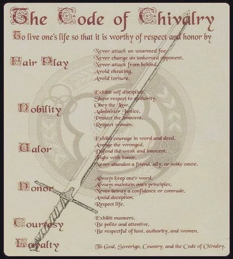

# Week 1: Branding Yourself

> Authors: Latisha McNeel, Camden Kirkland

> Revised: *January 2018*

## Purpose

As a developer, you are selling your skills, your ability to code, your ability to think. As you build your portfolio and show off the amazing work you have previously completed, it adds a step of professionalism to have consistency in how you code, how your online presence looks and how you present yourself.

An important step in the presentation online and in-person is deciding what you want to represent and how you want to be perceived. 

The following steps are to help you begin to develop your personal brand.

## Steps

1. Think of 5 adjectives to describe yourself in a professional environment. **Tip**: If you’re having trouble, look up Tom Rath’s Strengths Finder 2.0. Additionally, taking a Meyer-Briggs typology at 16personalities.com can help you understand your personal psychology!)
2. Think of 5 adjectives to describe how you want to be perceived
3. Read the following articles on color theory:
    * https://www.smashingmagazine.com/2010/01/color-theory-for-designers-part-1-the-meaning-of-color/
    * https://medium.freecodecamp.org/an-intro-to-color-theory-how-to-combine-colors-and-set-the-mood-of-your-designs-79bf5a45b3d
    * http://www.color-wheel-pro.com/color-meaning.html
    * Which two colors represent how you want others to perceive you
4. Read the following article of typography
    * https://www.smashingmagazine.com/2012/04/when-typography-speaks-louder-than-words/
    * Find two fonts that represent how you want to be perceived
5. Research industries and genres, pick 2 or 3 that represent how you want to be perceived 
6. Write a guide for what principles you will follow when completing projects - Essentially something like a Knight’s Code of Chivalry Code (See the image below)
    * https://designshack.net/articles/business-articles/why-every-designer-needs-a-code-of-ethics/
    * This is useful when you have to make decisions when working with clients or companies. If you have it written out, when a client asks you do something and you start wondering if it's worth the money, you can fall back on this because if it breaks on of the principles it will hurt your brand and ultimately your career. 
    * Companies also write code of ethics and usually distribute it or try to follow it or summarize it into a tagline
      * Unity, Integrity, Quality
7. Create a style guide that shows your brand 
    * https://jeremyriveraseo.com/content/style-guide-personal-brand/
    * https://www.canva.com/learn/personal-branding/
    * https://styleguide.mailchimp.com/

Use the above information when working on your portfolio and designing your HTML. Think of the adjectives when working for the visual aspect - whether how your code looks or how a site looks will represent you. 

## Other resources

---

Credits

[Code of Chivalry Image](http://www.medievalchronicles.com/medieval-knights/code-of-chivalry-knights/)